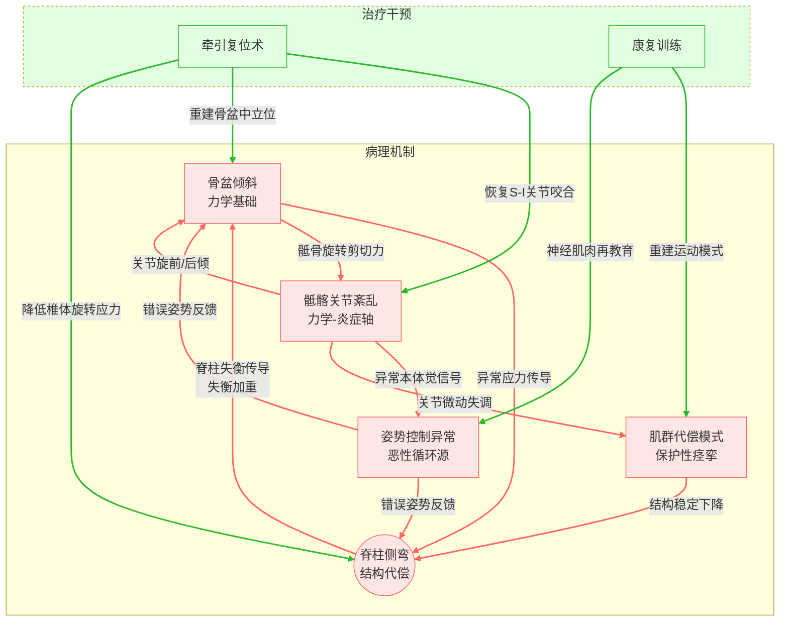

# 人体框架失衡：骨盆倾斜、脊柱侧弯与骶髂关节

## 三者之间的关系

- 骨盆倾斜、脊柱侧弯和骶髂关节功能之间存在紧密的解剖、生物力学和功能性联系。这三者的关系可以用以下逻辑梳理：骶髂关节的功能状态会直接影响骨盆的对称性和倾斜，而骨盆的倾斜则可能导致或加重脊柱的侧弯。反之，脊柱侧弯也会通过力学作用影响骨盆的位置和骶髂关节的稳定性。

## 骶髂关节功能异常 → 骨盆 → 脊柱

### 骶髂关节功能异常对骨盆的影响

- 骶髂关节是连接骶骨和髂骨的关节，主要负责承载上半身的重量并将力传递到下肢。
- 骶髂关节的活动范围很小，但如果其出现功能障碍（如不稳定、僵硬或炎症），将导致骨盆出现倾斜
- 骨盆倾斜分为前后方向的倾斜（骨盆前倾或后倾）和侧方向的倾斜（骨盆一侧升高或降低）:
  - 骨盆前倾或后倾：骶髂关节失去平衡时，骨盆前后方向的倾斜角度会发生异常变化。
  - 骨盆侧倾（高低不平）：一侧骶髂关节的功能异常（如松弛或僵硬）会导致骨盆两侧高度不一致，表现骨盆倾斜。

### 骶髂关节功能异常对脊柱的影响

骶髂关节是脊柱与骨盆的连接点，而骨盆是脊柱的“基础”；骶髂关节功能异常将通过骨盆传导到脊柱，影响其稳定性和对称性：

- 一侧骶髂关节过度松弛，会导致骨盆向松弛侧倾斜，为了保持身体的整体平衡，脊柱会出现代偿性弯曲。例如，当骨盆一侧升高时，脊柱可能在腰椎段向低侧弯曲形成侧弯。
- 一侧骶髂关节僵硬，会限制骨盆的正常活动范围，使脊柱产生异常的负荷分布，引发或加重侧弯。
- 如果骨盆倾斜长期未被纠正，脊柱的侧弯会逐渐从可逆的功能性侧弯转变为结构性侧弯，导致椎体旋转、关节紊乱甚至椎间盘退变。

## 脊柱侧弯 → 骨盆 → 骶髂关节

### 脊柱侧弯对骨盆的影响

- 侧倾代偿
  - 脊柱侧弯（如腰椎向左凸）时，骨盆会通过抬高左侧髂嵴（形成右髂高左髂低）以平衡脊柱侧向负荷，恢复身体中线重心。
- 旋转代偿
  - 胸椎侧弯可能伴随骨盆反向旋转（如胸椎右凸导致骨盆左旋），形成脊柱-骨盆链的螺旋式扭转。

### 脊柱侧弯对骶髂关节的影响

骶髂关节通过调整骨盆形态承接脊柱异常的力学负荷，但长期代偿可能引发功能异常：

- 单侧关节应力增加
  - 骨盆倾斜（如右髂升高、左髂降低）时，右侧骶髂关节承受更大垂直压力，而左侧骶髂关节因髂骨下拉导致前韧带张力增高，可能引发慢性炎症或关节错位。
- 活动范围受限
  - 骨盆旋转会引起骶髂关节面“锁死”，尤其是脊柱侧弯导致的深部肌群（如多裂肌、腰大肌）痉挛，可能进一步限制骶髂关节的微动能力。
- 退变与功能障碍
  - 长期非对称负荷可导致骶髂关节软骨磨损、纤维化（关节僵硬），或韧带松弛（关节不稳），最终发展为骶髂关节炎或骶髂关节综合征。

## 三者之间的综合作用关系

- 骶髂关节异常引起骨盆倾斜与脊柱侧弯
  - 骶髂关节松弛或僵硬 → 骨盆侧倾或旋转 → 脊柱代偿性侧弯。
  - 骶髂关节是三者作用关系中的“起点”，其功能异常往往是引发骨盆倾斜和脊柱侧弯的根源。

- 脊柱侧弯加重骨盆倾斜和骶髂关节异常
  - 脊柱侧弯 → 骨盆倾斜角度改变 → 骶髂关节受力不均，加重功能障碍。
