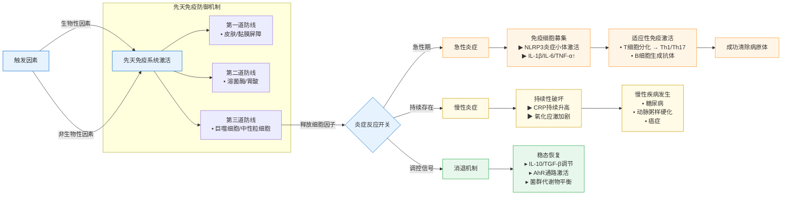

# 炎症

## 本质

- 防御性病理过程
  - 具备血管系统的生物体对损伤因子的系列防御反应
- 三维动态平衡
  - 损伤因子破坏 → 巨噬细胞启动防御 → 血管/白细胞反应 → 组织修复
- 生存必要性
  - 控制感染、清除坏死组织、修复损伤的关键生存机制

## 机制

1. 化学介质释放
    - 当组织受到损伤时，会释放一系列化学物质，如组胺、前列腺素等，它们能引起血管扩张和增加血管通透性，有利于白细胞和其他防御物质到达受伤部位。
2. 白细胞激活与迁移
    - 白细胞（主要是中性粒细胞和巨噬细胞）被激活后，会沿着化学信号梯度移动到损伤部位，吞噬并消灭病原体或清除死亡细胞。
3. 细胞因子的作用
    - 细胞因子是一类由免疫细胞产生的小蛋白，它们在调节炎症过程中起着关键作用。例如，IL-1、TNF-α等细胞因子能够促进炎症反应的发展。

## 三级病理演变

## 病理分型

| 特征维度   | 急性炎症               | 慢性炎症                   |
|------------|------------------------|----------------------------|
| 病程       | 数小时至数日           | 数月至数年                 |
| 病理特点   | 渗出为主               | 增生为主                   |
| 优势细胞   | 中性粒细胞             | 淋巴细胞/单核细胞          |
| 血管反应   | 显著扩张+通透性增高   | 新生毛细血管形成           |
| 介质系统   | 组胺/缓激肽快速释放    | 细胞因子网络调控           |

## 炎症介质系统

### 细胞源性介质谱系

| 功能分组 | 关键介质 | 主要生物学效应 |
|----------|----------|----------------|
| 血管动力学组 | 组胺/5-HT | 瞬时血管扩张 |
| | PGE2/PGI2 | 持续血管舒张 |
| 通透性调控组 | LTC4/LTD4 | 静脉内皮间隙扩大 |
| | PAF | 血小板活化协同效应 |
| 痛觉传导组 | PGE2 | 痛觉敏化放大器 |
| | 缓激肽 | 直接致痛因子 |
| 免疫调控组 | IL-1/IL-6 | 急性期蛋白合成 |
| | TNF-α | 内皮激活 |
| | IFN-γ | 巨噬细胞极化 |

### 血浆蛋白级联系统

| 系统名称   | 激活途径             | 关键介质       | 生物效应                     |
|------------|----------------------|----------------|------------------------------|
| 激肽系统   | XII因子接触激活      | 缓激肽         | 痛觉/血管通透性↑            |
| 补体系统   | 经典/旁路途径        | C3a/C5a        | 白细胞趋化/溶菌效应         |
| 凝血系统   | 组织因子暴露         | 凝血酶         | 纤维蛋白网形成              |
| 纤溶系统   | 纤溶酶原激活         | 纤维蛋白降解物 | 血管通透性调节              |

## 慢性炎症

### 病理特征三联征

- 细胞浸润模式
  - 单核 - 巨噬细胞轴心 + 淋巴细胞辅助
- 组织重构过程
  - 巨噬细胞活化 → 促炎介质释放 → 成纤维细胞增殖 → 胶原沉积 → 组织纤维化
- 免疫交互网络
  - 抗原呈递 (巨噬细胞) → T细胞活化 → IFN-γ反馈 → 巨噬细胞再激活

### 临床亚型鉴别

- 感染性慢性炎症
  - 结核肉芽肿形成机制
- 代谢性慢性炎症
  - 动脉粥样硬化斑块进展
- 自身免疫性炎症
  - 类风湿关节炎滑膜病变

## 炎症与免疫

